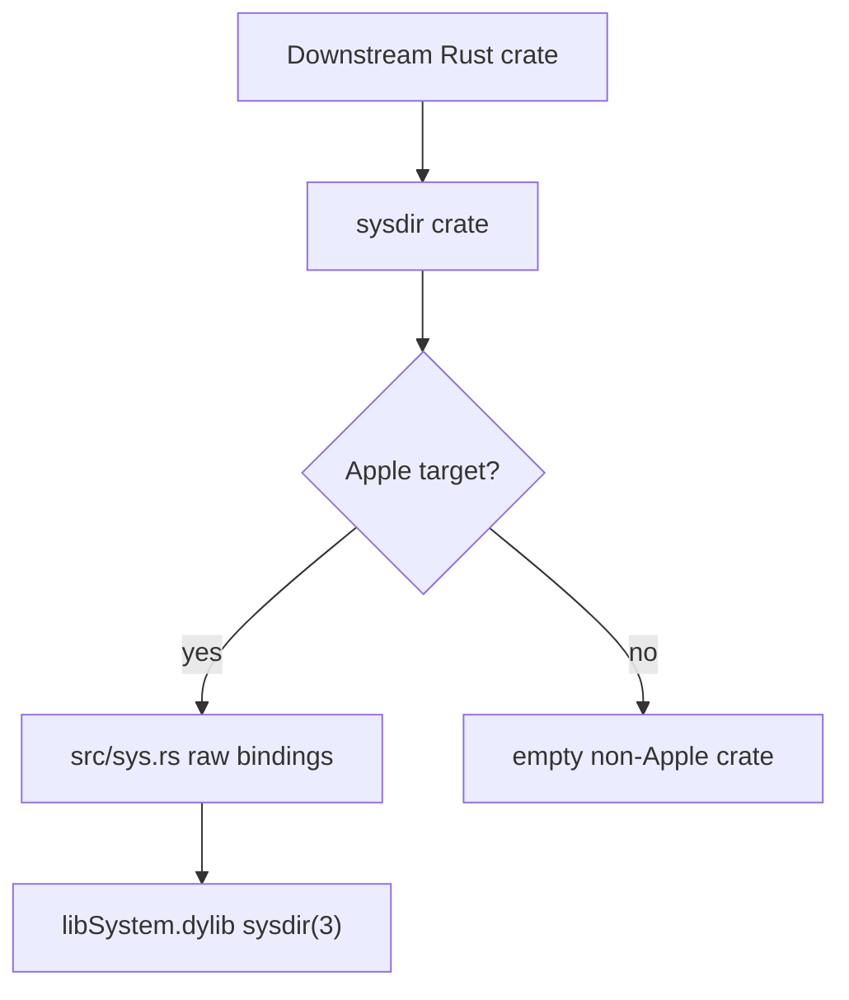
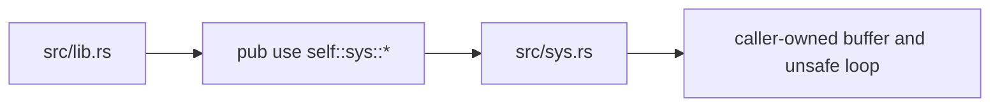
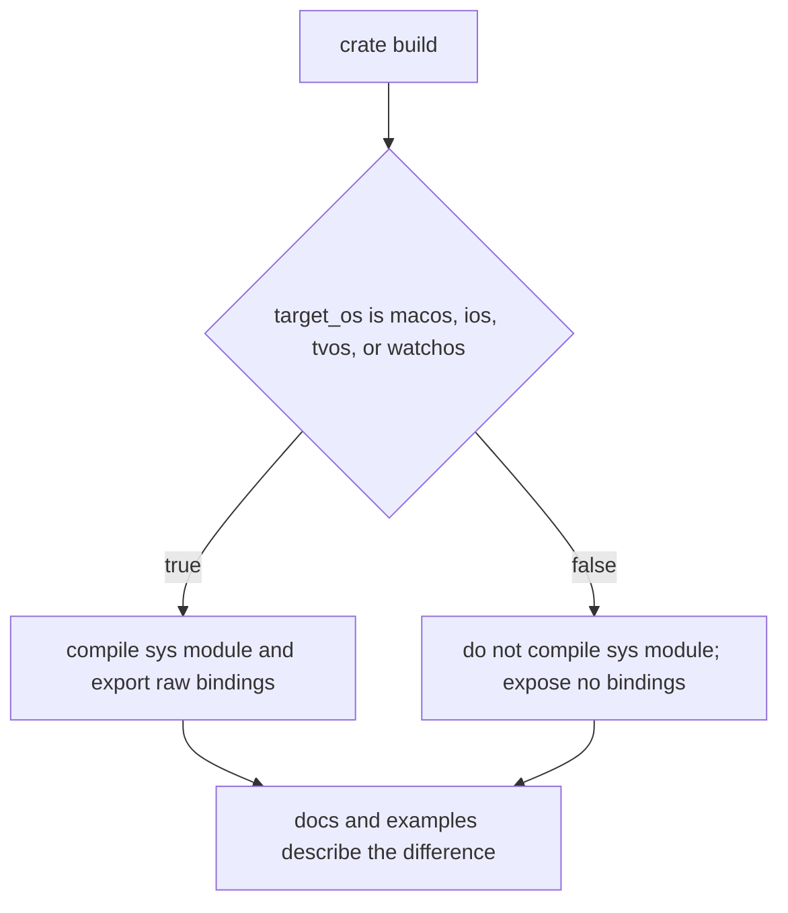
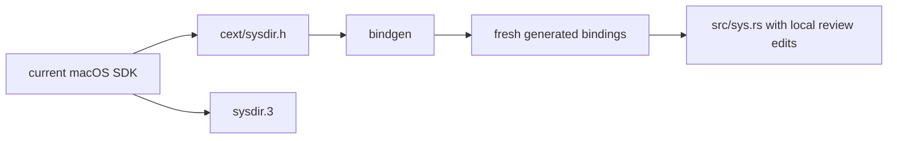

# sysdir-rs Architecture

`sysdir-rs` is a small raw binding crate for Darwin's `sysdir(3)` API. On Apple
targets, it exposes the constants, types, and functions needed to enumerate
standard system directories. On every other target, it intentionally compiles as
an empty `no_std` crate.

The crate's architecture is mostly a set of boundaries. Preserve those
boundaries before changing implementation details.

## Overview

The crate root is the public API boundary. It owns crate-level lint policy,
`no_std`, user-facing documentation, README doctesting, the bundled man page in
docs, and the target gate that decides whether any bindings are exported.

The generated binding module is the platform ABI boundary. It is compiled and
re-exported only for macOS, iOS, tvOS, and watchOS. It should preserve the
upstream C API's names, integer widths, constants, signatures, and raw pointer
shape.

There is no safe wrapper layer today. Callers interact with the raw C-shaped
API, including the unsafe function calls and caller-provided path buffer.

## Codemap

`src/lib.rs` is the crate root and the main file to read first. It defines the
public crate contract: `no_std`, platform support, linkage, path semantics,
doctests, the `man` documentation module, the Apple target gate, and the public
re-export of `sys`.

`src/sys.rs` is checked-in bindgen output with repository-local review edits. It
contains the raw `sysdir(3)` constants, Rustified directory enum, domain mask
type, extern functions, and the transparent enumeration-state wrapper. Treat
this file as generated source, not scratch code.

`cext/sysdir.h` is the bindgen input. It is deliberately small so binding
refreshes have a narrow SDK-facing surface.

`sysdir.3` is the bundled man page. It is the local upstream-behavior reference
used by crate docs, reviews, and binding freshness work.

`examples/enumerate_system_dirs.rs` is the executable example. It demonstrates
the raw enumeration API on Apple targets and returns a clear unsupported
platform error elsewhere.

`tests/next_root.rs` verifies behavior that is easy to accidentally normalize
away: `NEXT_ROOT` can affect returned paths, including with non-UTF-8 bytes.

`README.md` and crate docs should tell the same user-facing story: Apple-only
raw bindings, empty off-target builds, no extra dependencies, `no_std`, raw path
semantics, and the current MSRV.

`docs/guardrails/` contains durable review standards. Use the topic-specific
guardrail when changing a compatibility surface. The architecture file tells you
where a thing lives; guardrails tell you how to change it safely.

`docs/automations/` contains recurring maintenance runbooks. The binding
freshness runbook is the important one for architecture because it explains how
SDK-derived files are refreshed without erasing local review edits.

## Public API Shape

The public API is intentionally close to C:

- `PATH_MAX` is exposed as the buffer-size constant used by `sysdir(3)`.
- `sysdir_search_path_directory_t` models upstream directory constants.
- `sysdir_search_path_domain_mask_t` models upstream domain masks.
- `sysdir_start_search_path_enumeration` and
  `sysdir_get_next_search_path_enumeration` are unsafe extern functions.
- `sysdir_search_path_enumeration_state` is an opaque transparent wrapper with a
  small helper for detecting the finished state.

Changing names, visibility, reprs, integer types, target gates, or helper
semantics is public API work. It needs semver review even if the diff is small.

## Target Boundary

The target gate is an API boundary, not an implementation convenience. Apple
targets get raw bindings to symbols supplied by `libSystem`. Non-Apple targets
get an empty crate that still builds cleanly.

Keep target predicates centralized and obvious. If a new Apple platform target
is added, update the crate docs, README, docs.rs metadata, examples, tests, and
guardrails as needed.

## Path Semantics

`sysdir-rs` preserves Darwin's raw search-path strings. It does not normalize,
expand, validate, or allocate paths for callers.

Architectural invariants:

- user-domain results may contain a literal `~`;
- `NEXT_ROOT` may prefix local, network, and system-domain results;
- returned bytes are not guaranteed to be UTF-8;
- callers own expansion, validation, and filesystem use;
- no safe path abstraction should be added inside the raw binding layer.

If the crate ever grows a safe wrapper, make it a separate visible layer with
its own docs, tests, error semantics, and semver story. Do not quietly add
normalization behavior to `src/sys.rs` or the existing raw re-export.

## Binding Provenance

`src/sys.rs` is generated, but checked in and reviewed as source. Local edits
include the repository license header, generation marker, lint posture,
`#[non_exhaustive]` on the directory enum, and the opaque state helper.

Binding refreshes should be isolated from unrelated cleanup. Compare generated
output against the checked-in file, then apply only intentional API-surface or
provenance updates while preserving local edits that remain valid.

## Test And Documentation Surfaces

The tests and docs encode compatibility facts:

- crate doctests and README doctests keep examples honest on supported targets;
- library tests prove the basic enumeration loop and `libSystem` linkage;
- `NEXT_ROOT` integration tests protect raw byte and non-UTF-8 behavior;
- the example demonstrates complete enumeration without adding a library-level
  wrapper;
- text formatting keeps repository knowledge legible for agents and humans.

Docs-only changes may skip Rust tests when the PR says why, but Markdown should
still be formatted. Behavior, target, binding, or public API changes should run
the matching checks from `CONTRIBUTING.md` and the relevant guardrail.

## Cross-Cutting Invariants

- The crate remains `no_std` and no-alloc in its library API.
- The crate has no third-party Rust dependencies.
- Apple platform behavior follows `sysdir(3)` rather than a normalized Rust
  abstraction.
- Non-Apple builds remain empty instead of emulating Darwin directories.
- `libSystem` is the only system linkage expectation for the library.
- Generated binding changes are release-relevant and reviewed separately.
- Public docs, README, Cargo metadata, docs.rs metadata, and tests must stay in
  sync when compatibility claims change.
